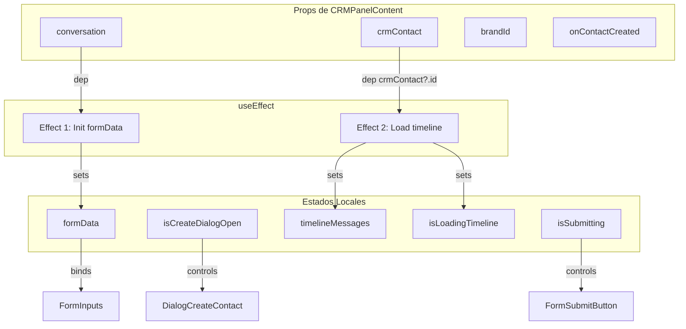

# Auditoría de CRMContextPanel.tsx

**Fecha:** 20 Enero 2026  
**Archivo:** `client/src/components/CRMContextPanel.tsx`  
**Líneas:** 729  
**Tarea:** 1.1.4 del Plan de Mejoras Técnicas 2026

---

## 1. Resumen Ejecutivo

CRMContextPanel es significativamente más simple que Inbox.tsx:
- **10 hooks totales** (vs 63 en Inbox.tsx)
- **729 líneas** (vs 2500+ en Inbox.tsx)
- **Estructura limpia:** Sin prop drilling significativo
- **Recomendación:** Bajo prioridad de refactor - componente bien estructurado

### Inventario de Hooks (10 total)

| Tipo | Cantidad | Ubicación | Estado |
|------|----------|-----------|--------|
| useState | 5 | L149-157 (dentro de CRMPanelContent) | ➖ No requiere refactor |
| useEffect | 2 | L163, L173 | ➖ No requiere refactor |
| Custom Hook (mutación) | 1 | useReminderOptOut L159 | ✅ Ya es hook |
| Router Hook | 1 | useLocation L148 | ✅ Estándar |
| UI Hook | 1 | useIsMobile L680 (en CRMContextPanel) | ✅ Estándar |
| **TOTAL** | **10** | — | ✅ Componente bien estructurado |

---

## 2. Arquitectura del Componente

```
CRMContextPanel (export, L677-729)
    └── CRMPanelContent (función interna, L129-672)
            ├── Rendering condicional (loading, no contact, with contact)
            └── Sub-secciones: Profile, Channels, Timeline, Actions
```

**Patrón:** El componente principal solo maneja la presentación (Desktop con panel lateral, Mobile con Drawer), delegando toda la lógica a `CRMPanelContent`.

---

## 3. Inventario Detallado de Hooks

### 3.1 useState (5 estados)

| # | Variable | Tipo | Línea | Propósito |
|---|----------|------|-------|-----------|
| 1 | `isCreateDialogOpen` | boolean | L149 | Controla visibilidad del diálogo de crear contacto |
| 2 | `isSubmitting` | boolean | L150 | Estado de carga durante creación de contacto |
| 3 | `timelineMessages` | TimelineMessage[] | L151 | Mensajes del timeline del contacto |
| 4 | `isLoadingTimeline` | boolean | L152 | Estado de carga del timeline |
| 5 | `formData` | {displayName, email, phone} | L153-157 | Datos del formulario de creación |

### 3.2 useEffect (2 efectos)

| # | Línea | Dependencias | Propósito |
|---|-------|--------------|-----------|
| 1 | L163-171 | `[conversation]` | Inicializa formData cuando cambia la conversación |
| 2 | L173-198 | `[crmContact?.id]` | Carga timeline cuando hay contacto CRM |

### 3.3 Hooks Externos

| Hook | Línea | Fuente | Propósito |
|------|-------|--------|-----------|
| `useLocation` | L148 | wouter | Navegación a página CRM |
| `useReminderOptOut` | L159 | @/hooks/useReminderRules | Mutación para opt-out de reminders |
| `useIsMobile` | L680 | @/hooks/use-mobile | Detecta si es móvil para cambiar layout |

---

## 4. Diagrama de Dependencias



### Cadenas de Dependencia

1. **conversation → formData** (1 hop): Cuando cambia la conversación, se inicializa el formulario
2. **crmContact?.id → timeline** (1 hop): Cuando hay contacto, se carga su timeline

**No hay dependencias circulares ni cadenas profundas.**

---

## 5. Props Recibidas

```typescript
interface CRMContextPanelProps {
  crmContact?: CrmContact;           // Datos del contacto CRM
  crmChannels?: CrmContactChannel[]; // Canales asociados al contacto
  isLoadingContact?: boolean;        // Estado de carga desde padre
  conversation?: Conversation | null; // Conversación activa
  brandId: string;                   // ID de la marca actual
  isOpen: boolean;                   // Controla visibilidad (drawer/panel)
  onClose: () => void;               // Callback para cerrar
  onContactCreated?: () => void;     // Callback tras crear contacto
}
```

**Fuente de props (desde Inbox.tsx):**

| Prop | Origen |
|------|--------|
| `crmContact` | `crmContactData?.contact` (useQuery) |
| `crmChannels` | `crmContactData?.channels` (useQuery) |
| `isLoadingContact` | `isLoadingCrmContact` (useQuery) |
| `conversation` | `activeConversation` (NexusContext) |
| `brandId` | `activeClientId` (NexusContext) |
| `isOpen` | `isCRMOpen` (useState L457 de Inbox) |
| `onClose` | inline `() => setIsCRMOpen(false)` |
| `onContactCreated` | invalidateQueries callback |

---

## 6. Análisis de Complejidad

### Fortalezas ✅

1. **Separación clara:** CRMPanelContent contiene toda la lógica, CRMContextPanel solo layout
2. **Pocos estados:** 5 estados simples, todos con propósito claro
3. **Efectos limpios:** Solo 2 efectos con dependencias mínimas
4. **Sin prop drilling:** Props solo bajan un nivel (CRMContextPanel → CRMPanelContent)

### Áreas de Mejora (Baja Prioridad)

| Área | Problema | Impacto | Recomendación |
|------|----------|---------|---------------|
| Fetching manual | L181-198 usa fetch directo | Bajo | Migrar a TanStack Query para consistencia |
| Componentes helpers | StatusBadge, LifecycleBadge definidos fuera | Neutro | Mover a archivo separado si se reutilizan |

---

## 7. Comparación con Inbox.tsx

| Métrica | Inbox.tsx | CRMContextPanel.tsx | Factor |
|---------|-----------|---------------------|--------|
| Líneas de código | 2500+ | 729 | 3.4x menor |
| Total hooks | 63 | 10 | 6.3x menor |
| useState | 40 | 5 | 8x menor |
| useEffect | 8 | 2 | 4x menor |
| Hooks externos/custom | 15 | 3 | 5x menor |
| Props pasadas a hijos | 25 (a CommentThread) | 8 (a CRMPanelContent) | 3x menor |
| Cadenas de dependencia | 4 críticas de 4-5 hops | 0 críticas | ∞ mejor |
| Prioridad de refactor | 🔴 Alta | 🟢 Baja | N/A |

---

## 8. Recomendaciones

### No Refactorizar Ahora

CRMContextPanel está bien estructurado y no necesita refactor inmediato. El tiempo es mejor invertido en:
1. Inbox.tsx (63 hooks, prop drilling severo)
2. CommentThread.tsx (25 props, múltiples capas de drilling)

### Mejoras Futuras (Backlog)

1. **Consistencia de fetching:** Reemplazar fetch manual por useQuery para el timeline
2. **Extracción de badges:** Si StatusBadge/LifecycleBadge se usan en otros lugares, moverlos a `@/components/ui/`

---

## 9. Conclusión

CRMContextPanel.tsx es un ejemplo de componente bien estructurado:
- Separación de presentación (CRMContextPanel) y lógica (CRMPanelContent)
- Estados con propósito claro y limitado
- Efectos simples sin dependencias circulares
- Sin prop drilling problemático

**Veredicto:** ✅ Bajo prioridad de refactor. Continuar con tareas de Inbox.tsx.
