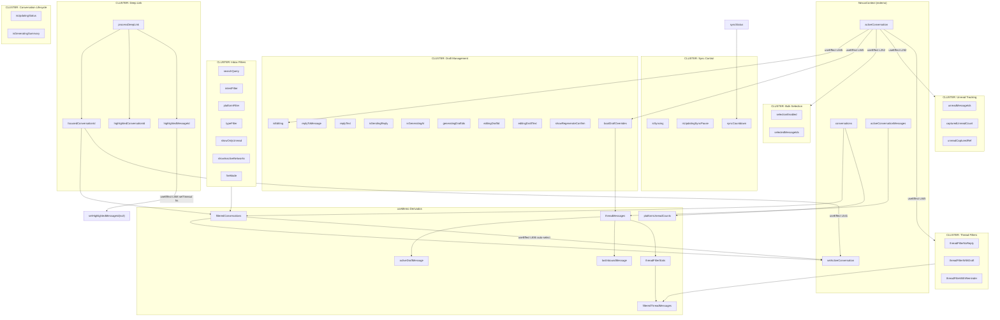

# Auditoría de Hooks - Inbox.tsx

**Fecha:** 20 Enero 2026  
**Archivo:** `client/src/components/Inbox.tsx`  
**Líneas totales:** 2,727  
**Total hooks:** 63 (useState: 40, useEffect: 8, useMemo: 9, useCallback: 2, useRef: 4)

---

## Resumen Ejecutivo

El componente Inbox.tsx tiene una cantidad significativa de estado local que podría organizarse mejor en hooks personalizados por dominio funcional.

### Categorías Identificadas (Corregidas)

| Categoría | Estados | Candidato a Hook | Estado |
|-----------|---------|------------------|--------|
| Draft/Reply Management | 10 | `useDraftManagement` | ⬜ Pendiente |
| Conversation Lifecycle | 2 | `useConversationLifecycle` | ⬜ Pendiente |
| Sync Control | 3 | `useSyncStatus` | ⬜ Pendiente |
| Conversation List Filters | 7 | `useInboxFilters` | ⬜ Pendiente |
| Thread Filters | 3 | (incluir en `useInboxFilters`) | ⬜ Pendiente |
| Deep Link/Focus Mode | 3 | `useDeepLink` | ⬜ Pendiente |
| Bulk Selection | 2 | Ya existe `useBulkDraftQueue` | ✅ Existe |
| Unread Tracking | 2 | `useUnreadTracking` | ⬜ Pendiente |
| Audio Player | 4 | `useAudioPlayer` (interno) | ⬜ Pendiente |
| UI Toggles | 4 | Local (no extraer) | ➖ N/A |
| **TOTAL** | **40** | | |

---

## 1. useState (40 instancias)

### 1.1 Draft/Reply Management (10 estados)

| Línea | Estado | Tipo | Propósito |
|-------|--------|------|-----------|
| 202 | `isEditing` | boolean | Modo edición activo |
| 204 | `replyToMessage` | Message \| null | Mensaje al que se está respondiendo |
| 205 | `replyText` | string | Texto del reply manual |
| 206 | `isSendingReply` | boolean | Loading: enviando reply |
| 207 | `isGeneratingAI` | boolean | Loading: generando IA |
| 208 | `generatingDraftIds` | Set<string> | IDs de mensajes generando draft |
| 209 | `editingDraftId` | string \| null | ID del draft en edición |
| 210 | `editingDraftText` | string | Texto del draft en edición |
| 211 | `showRegenerateConfirm` | string \| null | ID para confirmar regeneración |
| 212 | `localDraftOverrides` | Map<...> | Overrides locales para drafts |

**Candidato a hook:** `useDraftManagement` - Gestión de borradores y respuestas.

### 1.2 Conversation Lifecycle (2 estados)

| Línea | Estado | Tipo | Propósito |
|-------|--------|------|-----------|
| 337 | `isUpdatingStatus` | boolean | Loading: actualizando status de conversación |
| 338 | `isGeneratingSummary` | boolean | Loading: generando summary IA al cerrar |

**Candidato a hook:** `useConversationLifecycle` - Manejo de estados y resúmenes de conversación.

### 1.3 Sync Control (3 estados)

| Línea | Estado | Tipo | Propósito |
|-------|--------|------|-----------|
| 203 | `isSyncing` | boolean | Sincronizando con Metricool |
| 336 | `isUpdatingSyncPause` | boolean | Actualizando pause state |
| 430 | `syncCountdown` | number \| null | Countdown para próximo sync |

**Candidato a hook:** `useSyncStatus` - Estado de sincronización con Metricool.

### 1.4 Conversation List Filters (7 estados)

| Línea | Estado | Tipo | Propósito |
|-------|--------|------|-----------|
| 452 | `searchQuery` | string | Búsqueda en conversaciones |
| 453 | `intentFilter` | Intent \| 'all' | Filtro por intención |
| 454 | `platformFilter` | Platform \| 'all' | Filtro por plataforma |
| 455 | `typeFilter` | MessageType \| 'all' | Filtro por tipo (DM/comment) |
| 456 | `fireMode` | boolean | Modo de urgencia activado |
| 458 | `showInactiveNetworks` | boolean | Mostrar redes inactivas |
| 459 | `showOnlyUnread` | boolean | Solo mostrar no leídos |

**Candidato a hook:** `useInboxFilters` - Todos los filtros de lista de conversaciones.

### 1.5 Thread-Level Filters (3 estados)

| Línea | Estado | Tipo | Propósito |
|-------|--------|------|-----------|
| 468 | `threadFilterNoReply` | boolean | Filtro: comentarios sin respuesta |
| 469 | `threadFilterWithDraft` | boolean | Filtro: comentarios con borrador |
| 470 | `threadFilterWithReminder` | boolean | Filtro: comentarios con recordatorio |

**Recomendación:** Incluir en `useInboxFilters` o crear `useThreadFilters`.

### 1.6 Deep Link/Focus Mode (3 estados)

| Línea | Estado | Tipo | Propósito |
|-------|--------|------|-----------|
| 460 | `highlightedConversationId` | string \| null | Conversación resaltada (deep link) |
| 461 | `highlightedMessageId` | string \| null | Mensaje resaltado |
| 462 | `focusedConversationId` | string \| null | Modo foco (desde notificación) |

**Candidato a hook:** `useDeepLink` - Manejo de deep links y navegación desde notificaciones.

### 1.7 Bulk Selection (2 estados)

| Línea | Estado | Tipo | Propósito |
|-------|--------|------|-----------|
| 215 | `selectionEnabled` | boolean | Modo selección múltiple activo |
| 216 | `selectedMessageIds` | Set<string> | IDs seleccionados |

**Nota:** Relacionado con `useBulkDraftQueue` hook existente (línea 224).

### 1.8 Unread Tracking (2 estados)

| Línea | Estado | Tipo | Propósito |
|-------|--------|------|-----------|
| 219 | `unreadMessageIds` | Set<string> | IDs de mensajes no leídos |
| 221 | `capturedUnreadCount` | number | Contador capturado al abrir conversación |

**Candidato a hook:** `useUnreadTracking` - Seguimiento de mensajes no leídos.

### 1.9 Audio Player (4 estados - líneas 2398-2403)

| Línea | Estado | Tipo | Propósito |
|-------|--------|------|-----------|
| 2398 | `isPlaying` | boolean | Audio reproduciéndose |
| 2399 | `currentTime` | number | Tiempo actual audio |
| 2400 | `duration` | number | Duración audio |
| 2401 | `showTranscription` | boolean | Mostrar transcripción |

**Candidato a hook:** `useAudioPlayer` (componente interno, podría extraerse).

### 1.10 UI Toggles (4 estados)

| Línea | Estado | Tipo | Propósito |
|-------|--------|------|-----------|
| 457 | `isCRMOpen` | boolean | Panel CRM abierto/cerrado |
| 463 | `showScrollToTop` | boolean | Mostrar botón scroll-to-top |
| 464 | `isBulkButtonHovered` | boolean | Hover en botón bulk |
| 2636 | `isExpanded` | boolean | Estado expandido (subcomponente) |

**Recomendación:** Estados UI locales, no requieren extracción a hooks.

---

## 2. useEffect (8 instancias)

| Línea | Dependencias | Propósito | Complejidad |
|-------|--------------|-----------|-------------|
| 252 | `[activeConversation?.id]` | Reset selection/unread al cambiar conversación | Baja |
| 263 | `[activeConversation?.id, activeConversationMessages, capturedUnreadCount]` | Capturar IDs de mensajes no leídos | Media |
| 432 | `[syncStatus?.lastSyncTime, brandSyncStatus?.syncPaused]` | Actualizar countdown de sync | Media |
| 510 | `[processDeepLink]` | Procesar deep links al montar y navigation events | Media |
| 541 | `[focusedConversationId, conversations, activeConversation, setActiveConversation]` | Auto-seleccionar conversación de deep link | Baja |
| 558 | `[highlightedMessageId]` | Limpiar highlight después de timeout | Baja |
| 836 | `[filteredConversations, activeConversation, isMobile, setActiveConversation]` | Auto-seleccionar primera conversación (desktop) | Baja |
| 845 | `[activeConversation?.id]` | Reset editing state y filtros al cambiar | Baja |

---

## 3. useMemo (9 instancias)

| Línea | Nombre/Descripción | Dependencias | Propósito |
|-------|-------------------|--------------|-----------|
| 579 | `activeProviders` | `[socialAccounts]` | Providers activos normalizados |
| 583 | `inactiveProviders` | `[socialAccounts]` | Providers inactivos |
| 621 | `platformUnreadCounts` | `[conversations]` | Conteo no leídos por plataforma |
| 633 | `threadMessages` | `[activeConversationMessages, localDraftOverrides]` | Mensajes ordenados en hilo (recursivo) |
| 693 | `activeDraftMessage` | `[threadMessages]` | Mensaje con draft activo |
| 700 | `lastInboundMessage` | `[threadMessages]` | Último mensaje entrante |
| 710 | `threadFilterStats` | `[threadMessages]` | Estadísticas para filtros de hilo |
| 792 | `filteredThreadMessages` | `[threadMessages, threadFilter*, threadFilterStats]` | Mensajes filtrados por thread filters |
| 2451 | `waveformPattern` | `[]` | Patrón visual para audio waveform |

---

## 4. useCallback (2 instancias)

| Línea | Nombre | Dependencias | Propósito |
|-------|--------|--------------|-----------|
| 304 | `handleUnreadSeen` | `[]` | Callback cuando mensaje no leído es visto |
| 486 | `processDeepLink` | `[]` | Procesar parámetros URL para deep links |

---

## 5. useRef (4 instancias)

| Línea | Nombre | Tipo | Propósito |
|-------|--------|------|-----------|
| 248 | `unreadCapturedRef` | `string \| null` | Evitar doble captura de unread IDs |
| 465 | `threadScrollRef` | `HTMLDivElement \| null` | Referencia al scroll del hilo |
| 2402 | `audioRef` | `HTMLAudioElement \| null` | Referencia al elemento audio |
| 2403 | `progressRef` | `HTMLDivElement \| null` | Referencia a la barra de progreso audio |

---

## Recomendaciones de Extracción (Prioridad Revisada)

### Prioridad ALTA

1. **`useDraftManagement`** (10 estados)
   - Agrupa: isEditing, replyToMessage, replyText, isSendingReply, isGeneratingAI, generatingDraftIds, editingDraftId, editingDraftText, showRegenerateConfirm, localDraftOverrides
   - Incluiría: handleGenerateAIReply, handleSendReply, handleCancelReply, handleGenerateDraft, handleRegenerateDraft, handleSaveDraftEdit, handleDiscardDraft, handleSendDraft, startEditingDraft, cancelEditingDraft
   - Impacto: Reduce ~250 líneas de Inbox.tsx (líneas 202-212, 869-1183)

2. **`useInboxFilters`** (10 estados + 2 useMemos)
   - Agrupa: searchQuery, intentFilter, platformFilter, typeFilter, fireMode, showInactiveNetworks, showOnlyUnread, threadFilterNoReply, threadFilterWithDraft, threadFilterWithReminder
   - Incluiría: filteredConversations lógica, threadFilterStats, filteredThreadMessages, handlePlatformFilterClick
   - Impacto: Reduce ~150 líneas de Inbox.tsx

### Prioridad MEDIA

3. **`useConversationLifecycle`** (2 estados)
   - Agrupa: isUpdatingStatus, isGeneratingSummary
   - Incluiría: handleUpdateConversationStatus, handleGenerateSummary
   - Impacto: Reduce ~50 líneas de Inbox.tsx

4. **`useSyncStatus`** (3 estados + 1 effect)
   - Agrupa: isSyncing, isUpdatingSyncPause, syncCountdown
   - Incluiría: handleSyncData, handleToggleSyncPause, getTimeSinceSync, el useEffect de countdown
   - Impacto: Reduce ~80 líneas de Inbox.tsx

5. **`useDeepLink`** (3 estados + 2 effects + 1 callback)
   - Agrupa: highlightedConversationId, highlightedMessageId, focusedConversationId
   - Incluiría: processDeepLink, exitFocusMode, los 2 useEffects relacionados
   - Impacto: Reduce ~70 líneas de Inbox.tsx

### Prioridad BAJA

6. **`useUnreadTracking`** (2 estados + 1 ref + 2 effects + 1 callback)
   - Agrupa: unreadMessageIds, capturedUnreadCount, unreadCapturedRef
   - Incluiría: handleUnreadSeen, los 2 useEffects de captura
   - Impacto: Reduce ~40 líneas de Inbox.tsx

7. **`useAudioPlayer`** (4 estados + 2 refs + 1 useMemo) - Componente interno
   - Agrupa: isPlaying, currentTime, duration, showTranscription, audioRef, progressRef, waveformPattern
   - Nota: Ya está relativamente aislado en líneas 2398-2500, podría extraerse como componente separado
   - Impacto: Reduce ~100 líneas si se extrae como componente

---

## 6. Diagrama de Dependencias (Tarea 1.1.2)

### 6.1 Diagrama Mermaid - Clusters por Dominio



### 6.2 Tabla de Dependencias Completa

| Estado | Upstream (quién lo actualiza) | Downstream (a quién afecta) | Trigger/Condición |
|--------|-------------------------------|-----------------------------|--------------------|
| **SELECTION CLUSTER** |
| `selectedMessageIds` | handleToggleSelection, handleClearSelection, useEffect L252, bulkDraftQueue.onComplete/onMessageComplete | BulkDraftActionBar UI, handleBulkGenerate | User click, conversation change, bulk complete |
| `selectionEnabled` | toggle button, useEffect L252, bulkDraftQueue.onComplete | Selection checkboxes visibility | User click, conversation change |
| **UNREAD CLUSTER** |
| `unreadMessageIds` | useEffect L263, handleUnreadSeen | Message highlight rings UI | Messages load, user scrolls (6s visibility) |
| `capturedUnreadCount` | useEffect L252 | useEffect L263 (captura IDs) | Conversation open |
| `unreadCapturedRef` | useEffect L252, useEffect L263 | Evita doble captura | Internal flag |
| **DEEP LINK CLUSTER** |
| `focusedConversationId` | processDeepLink, exitFocusMode | filteredConversations, useEffect L541 | URL params, exit button |
| `highlightedConversationId` | processDeepLink, exitFocusMode, setTimeout 3s | Conversation list highlight CSS | URL params, cleared after 3s |
| `highlightedMessageId` | processDeepLink, useEffect L558 (setTimeout 5s clears) | Message scroll-to, highlight ring | URL params, cleared after 5s |
| **FILTER CLUSTER** |
| `searchQuery` | input onChange | filteredConversations | User typing |
| `intentFilter` | Select onChange | filteredConversations (si implementado) | User selection |
| `platformFilter` | handlePlatformFilterClick | filteredConversations, showOnlyUnread | Platform icon click |
| `typeFilter` | Select onChange | filteredConversations | User selection |
| `showOnlyUnread` | handlePlatformFilterClick, toggle button | filteredConversations | Platform click con unread, toggle |
| `showInactiveNetworks` | toggle button | filteredConversations (excluye inactive providers) | User toggle |
| `fireMode` | toggle button | UI visual indicator (no filtrado activo) | User toggle |
| **THREAD FILTER CLUSTER** |
| `threadFilterNoReply` | chip click, useEffect L845 | filteredThreadMessages | User click, conversation change resets |
| `threadFilterWithDraft` | chip click, useEffect L845 | filteredThreadMessages | User click, conversation change resets |
| `threadFilterWithReminder` | chip click, useEffect L845 | filteredThreadMessages | User click, conversation change resets |
| **DRAFT CLUSTER** |
| `isEditing` | toggle, useEffect L845 | Draft UI mode | User toggle, conversation change resets |
| `replyToMessage` | handleStartReply, handleCancelReply | Reply composer visibility | User actions |
| `replyText` | input onChange, handleStartReply (reset), handleCancelReply (reset) | Reply composer content | User typing |
| `isSendingReply` | handleSendReply | Reply button loading | Send start/end |
| `isGeneratingAI` | handleGenerateAIReply | AI button loading | AI generation |
| `generatingDraftIds` | handleGenerateDraft, handleRegenerateDraft | Loading spinners per message | Draft generation start/end |
| `editingDraftId` | startEditingDraft, cancelEditingDraft, handleSaveDraftEdit | Draft textarea visibility | User actions |
| `editingDraftText` | startEditingDraft, cancelEditingDraft, input onChange | Draft textarea content | User editing |
| `showRegenerateConfirm` | handleRegenerateDraft (opens), confirm/cancel actions | Confirm dialog visibility | User clicks regenerate |
| `localDraftOverrides` | handleGenerateDraft, handleRegenerateDraft, handleSaveDraftEdit, handleDiscardDraft, handleSendDraft, useEffect L845 | threadMessages (merge) | Draft actions, conversation change resets |
| **LIFECYCLE CLUSTER** |
| `isUpdatingStatus` | handleUpdateConversationStatus | Dropdown disabled state | Status change start/end |
| `isGeneratingSummary` | handleGenerateSummary | Summary button loading | Summary generation start/end |
| **SYNC CLUSTER** |
| `syncCountdown` | useEffect L432 (interval 1s) | Countdown display in header | Timer updates every second |
| `isSyncing` | handleSyncData | Sync button loading spinner | Sync start/end |
| `isUpdatingSyncPause` | handleToggleSyncPause | Pause toggle button loading | Toggle start/end |
| **UI TOGGLES** |
| `isCRMOpen` | toggle button | CRM panel visibility | User toggle |
| `showScrollToTop` | scroll handler (internal) | Scroll-to-top button visibility | Scroll position |
| `isBulkButtonHovered` | mouse events | Bulk button tooltip/styling | Mouse enter/leave |
| **AUDIO PLAYER (interno, líneas 2398-2500)** |
| `isPlaying` | play/pause button | Audio element play state | User click |
| `currentTime` | audio timeupdate event | Progress bar position | Audio playback |
| `duration` | audio loadedmetadata event | Progress bar max | Audio load |
| `showTranscription` | toggle button | Transcription panel visibility | User toggle |
| **NESTED COMPONENT (AudioMessage, línea 2636)** |
| `isExpanded` | click on expandable section | Expanded content visibility | User click |
| **REFS** |
| `threadScrollRef` | React.useRef | Scroll container reference | Direct DOM access |
| `audioRef` | React.useRef | Audio element reference | Audio control |
| `progressRef` | React.useRef | Progress bar reference | Click-to-seek |

> **Checksum:** 40 useState documentados en tabla (coincide con inventario sección 1)

### 6.2.1 useEffect Triggers Completos (8 instancias)

| Línea | Dependencias | Estados que ACTUALIZA | Descripción |
|-------|--------------|----------------------|-------------|
| 252 | `[activeConversation?.id]` | selectedMessageIds, selectionEnabled, unreadMessageIds, capturedUnreadCount, unreadCapturedRef | Reset completo al cambiar conversación |
| 263 | `[activeConversation?.id, activeConversationMessages, capturedUnreadCount]` | unreadMessageIds, unreadCapturedRef | Captura IDs de mensajes no leídos |
| 432 | `[syncStatus?.lastSyncTime, brandSyncStatus?.syncPaused]` | syncCountdown | Actualiza countdown cada segundo |
| 510 | `[processDeepLink]` | (indirectamente via processDeepLink) | Ejecuta deep link al montar + navigation events |
| 541 | `[focusedConversationId, conversations, activeConversation, setActiveConversation]` | activeConversation (via setActiveConversation) | Auto-selecciona conversación de deep link |
| 558 | `[highlightedMessageId]` | highlightedMessageId | Limpia highlight después de 5s |
| 836 | `[filteredConversations, activeConversation, isMobile, setActiveConversation]` | activeConversation (via setActiveConversation) | Auto-selecciona primera conversación (desktop) |
| 845 | `[activeConversation?.id]` | isEditing, localDraftOverrides, threadFilterNoReply, threadFilterWithDraft, threadFilterWithReminder | Reset editing state y filtros |

### 6.3 Cadenas de Dependencia Multi-Hop (Críticas para Refactor)

```
1. Conversation Selection Chain (6 estados reseteados):
   activeConversation.id CHANGE
   └─► useEffect L252
       ├─► setSelectedMessageIds(empty)
       ├─► setSelectionEnabled(false)
       ├─► setUnreadMessageIds(empty)
       └─► setCapturedUnreadCount(unreadCount)
   └─► useEffect L845
       ├─► setIsEditing(false)
       ├─► setLocalDraftOverrides(empty)
       ├─► setThreadFilterNoReply(false)
       ├─► setThreadFilterWithDraft(false)
       └─► setThreadFilterWithReminder(false)

2. Deep Link Focus Chain:
   URL params
   └─► processDeepLink()
       ├─► setFocusedConversationId(id)
       ├─► setHighlightedConversationId(id)
       └─► setHighlightedMessageId(msgId)
   └─► useEffect L541
       └─► setActiveConversation(found)
   └─► setTimeout 3s → setHighlightedConversationId(null)
   └─► useEffect L558 → setTimeout 5s → setHighlightedMessageId(null)

3. Thread Message Derivation Chain:
   activeConversationMessages + localDraftOverrides
   └─► threadMessages (useMemo L633)
       ├─► activeDraftMessage (useMemo L693)
       ├─► lastInboundMessage (useMemo L700)
       └─► threadFilterStats (useMemo L710)
           └─► filteredThreadMessages (useMemo L792)

4. Platform Filter + Unread Chain:
   handlePlatformFilterClick(platform, hasUnread)
   ├─► setPlatformFilter(platform)
   └─► setShowOnlyUnread(hasUnread)
   └─► filteredConversations recalculates
```

### 6.4 Insights para Refactorización

**Co-cambios identificados (estados que SIEMPRE se actualizan juntos):**

| Grupo | Estados | Frecuencia | Acción Recomendada |
|-------|---------|------------|-------------------|
| Reset Conversation | selectedMessageIds, selectionEnabled, unreadMessageIds, capturedUnreadCount | Siempre | Mantener en mismo hook |
| Reset Thread State | isEditing, localDraftOverrides, threadFilter* | Siempre | Combinar en useInboxFilters |
| Deep Link Highlight | focusedConversationId, highlightedConversationId, highlightedMessageId | Siempre | Extraer a useDeepLink |
| Platform + Unread | platformFilter, showOnlyUnread | handlePlatformFilterClick | Mantener juntos en useInboxFilters |
| Draft Edit | editingDraftId, editingDraftText | startEditingDraft/cancelEditingDraft | Extraer a useDraftManagement |

**Acoplamiento crítico detectado:**
- `threadMessages` es el hub central: 5 useMemos dependen de él
- `activeConversation?.id` dispara 2 useEffects que resetean 10 estados combinados
- `filteredConversations` depende de 7 estados de filtro + focusedConversationId

---

## Notas Adicionales

1. **useBulkDraftQueue** (línea 224) ya existe como hook externo - buen ejemplo a seguir
2. **useWebSocket** (línea 191) ya fue refactorizado - modelo de referencia
3. El componente también usa **useQuery** de tanstack (líneas 312-334) para datos remotos:
   - `syncStatus` - Estado del sistema de sync
   - `brandSyncStatus` - Estado de sync por marca
   - `crmContactData` - Datos de contacto CRM
   - `socialAccounts` - Cuentas sociales conectadas
4. Hay lógica de audio player (líneas 2398-2500) que está relativamente aislada y podría extraerse como componente separado
5. El hook `useBulkDraftQueue` ya maneja parte de la lógica de selección bulk

---

## Impacto Estimado de Extracciones

| Hook Propuesto | Líneas a Mover | % de Inbox.tsx |
|----------------|----------------|----------------|
| `useDraftManagement` | ~250 | 9% |
| `useInboxFilters` | ~150 | 5.5% |
| `useSyncStatus` | ~80 | 3% |
| `useDeepLink` | ~70 | 2.5% |
| `useConversationLifecycle` | ~50 | 2% |
| `useUnreadTracking` | ~40 | 1.5% |
| `AudioPlayer` (componente) | ~100 | 4% |
| **TOTAL** | **~740** | **27%** |

Con estas extracciones, Inbox.tsx pasaría de ~2,727 líneas a ~1,987 líneas.

---

## Próximos Pasos

1. ✅ **Tarea 1.1.1** - Inventario de hooks completado
2. ⬜ **Tarea 1.1.2** - Identificar dependencias entre estados (diagrama incluido arriba)
3. ⬜ **Tarea 1.1.3** - Mapear props contracts Inbox → subcomponentes
4. ⬜ **Tarea 1.1.4** - Repetir auditoría para CRMContextPanel.tsx
5. ⬜ **Tarea 1.1.5** - Identificar lógica duplicada entre componentes
